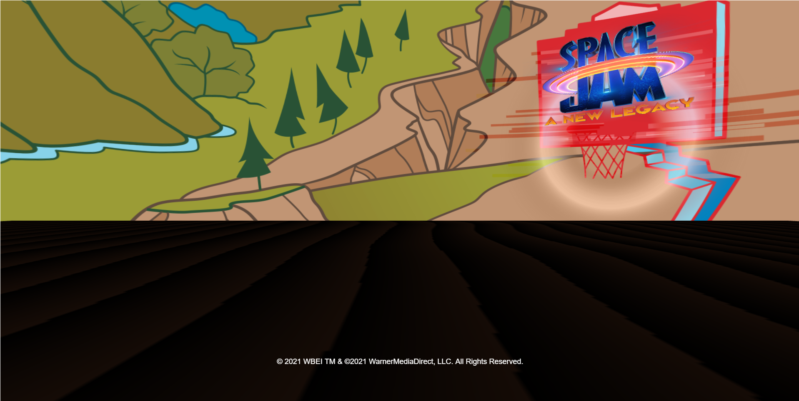

# _Space Jam: A New Legacy_ BabylonJS Mixed Reality Experience

This repository pairs with the BabylonJS Mixed Reality module that is part of the [Microsoft Learn learning path inspired by the _Space Jam: A New Legacy_ film](https://docs.microsoft.com/learn/paths/optimize-basketball-games-with-machine-learning/).

## Getting Started

There are two options for completing this module:
1. Write the code from scratch by [creating a repository based on the BabylonJS WebPack template](https://github.com/cassieview/babylonjs-webpack-typescript-starter-project/generate). Simply fill in the form, name your repository space-jam-a-new-legacy-babylonjs.
2. Create a repository based on this template repository by clicking "Use this template", or [clicking this generate link](https://github.com/microsoft/space-jam-a-new-legacy-babylonjs-template/generate) and filling in the form. Name your repository space-jam-a-new-legacy-babylonjs.

Once you have a repository on your personal GitHub account based on one of the above two template repositories, clone it to your local computer.

The rest of this README will assume you have generated a repository based on this template and clone it to your local computer.

## Running the Starter Code

To make sure you have the code working on your machine, you need to install the packages needed for this project, build the project, and start the project. 

To do this, open the repository folder in Visual Studio Code and open the terminal. 

Then run the following commands:

Install packages  
`npm install`

Build Project  
`npm run build`

Run the project  
`npm start`

If you navigate to [https://localhost:8080](https://localhost:8080) you should see the following empty scene:

Head back to the [Microsoft Learn module](https://docs.microsoft.com/learn/modules/build-mixed-reality-with-babylonjs) to continue learning how to build out this project. 

To see the completed project, you can switch to the `completed-code` branch.

## Using the CodeTour

[CodeTour](https://marketplace.visualstudio.com/items?itemName=vsls-contrib.codetour) is a Visual Studio Code extension that guides you through code with further explanation. For this project there are two CodeTours; one on the main branch (where you are filling in the code) and one on the `completed-code` branch (to guide you through the completed code).

To get started, open the `CODETOUR` tab in the Explorer pane and click play on the "Get Started" tour.

## Contributing

This project welcomes contributions and suggestions.  Most contributions require you to agree to a
Contributor License Agreement (CLA) declaring that you have the right to, and actually do, grant us
the rights to use your contribution. For details, visit https://cla.opensource.microsoft.com.

When you submit a pull request, a CLA bot will automatically determine whether you need to provide
a CLA and decorate the PR appropriately (e.g., status check, comment). Simply follow the instructions
provided by the bot. You will only need to do this once across all repos using our CLA.

This project has adopted the [Microsoft Open Source Code of Conduct](https://opensource.microsoft.com/codeofconduct/).
For more information see the [Code of Conduct FAQ](https://opensource.microsoft.com/codeofconduct/faq/) or
contact [opencode@microsoft.com](mailto:opencode@microsoft.com) with any additional questions or comments.

## Trademarks

This project may contain trademarks or logos for projects, products, or services. Authorized use of Microsoft 
trademarks or logos is subject to and must follow 
[Microsoft's Trademark & Brand Guidelines](https://www.microsoft.com/en-us/legal/intellectualproperty/trademarks/usage/general).
Use of Microsoft trademarks or logos in modified versions of this project must not cause confusion or imply Microsoft sponsorship.
Any use of third-party trademarks or logos are subject to those third-party's policies.

© 2021 WBEI TM & ©2021 WarnerMediaDirect, LLC. All Rights Reserved.
